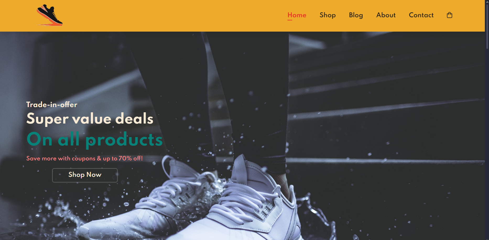
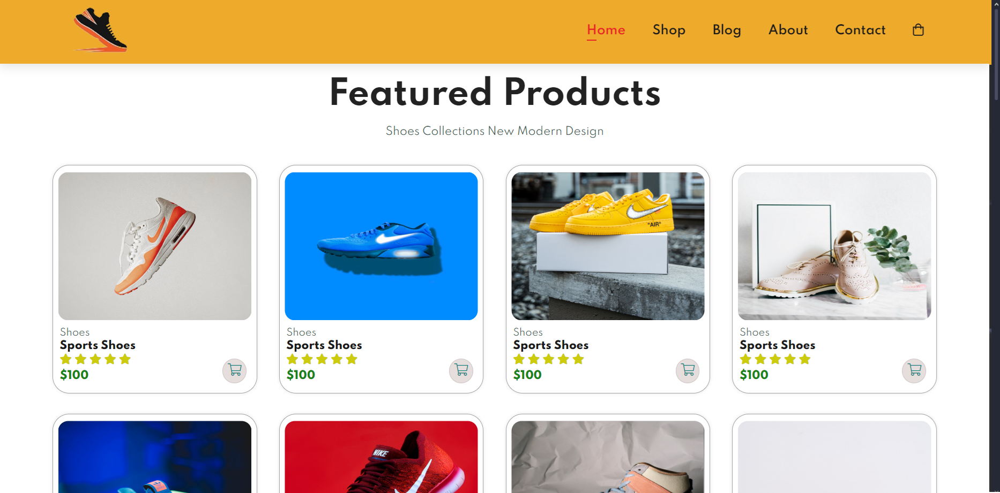
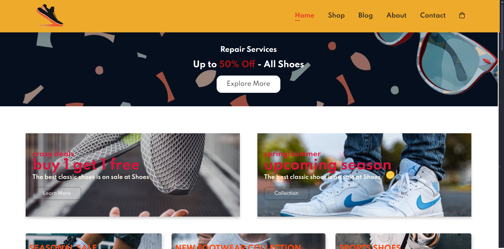
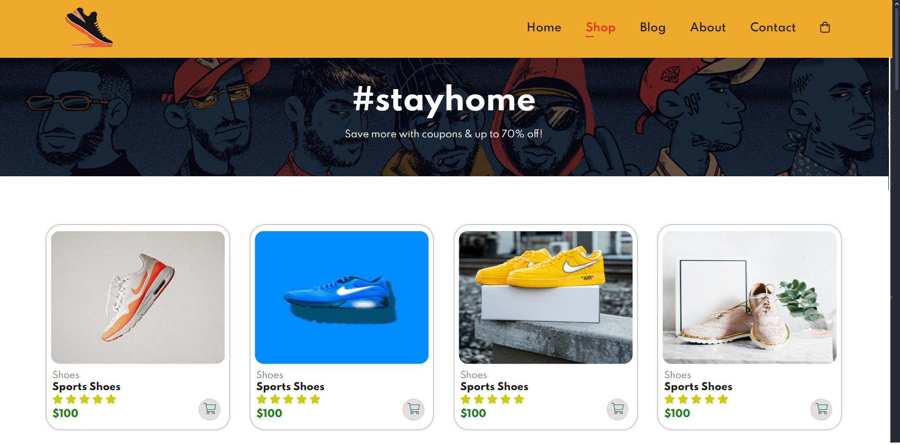
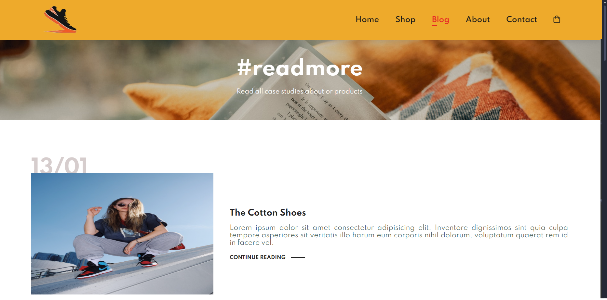
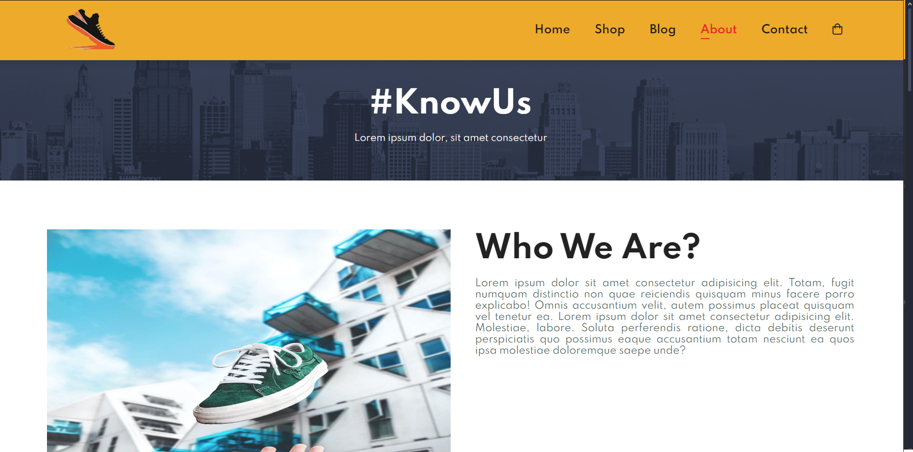
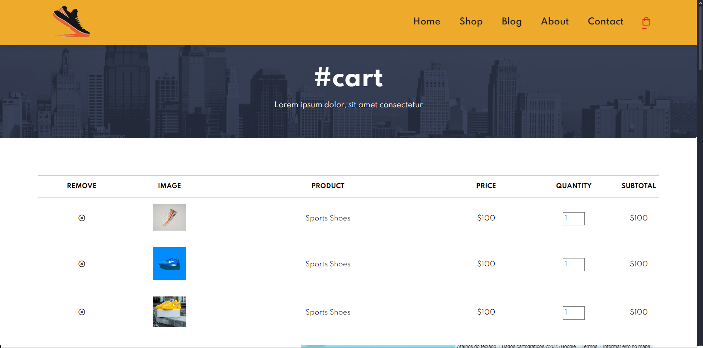
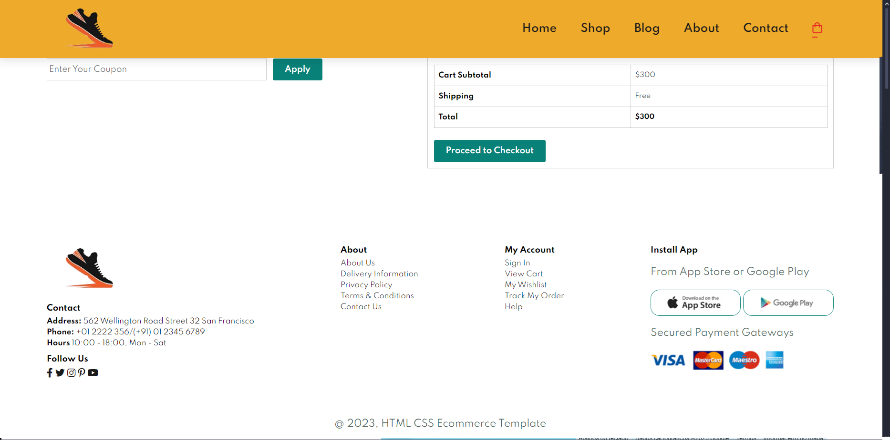

# ShoesEcommerce
A responsive Ecommerce site using using HTML/CSS & JavaScript and the idea of ​​Mobile First

## Home Page

## Shop Page

## Blog Page

## About Page

## Contact Page

## Cart Page

>[!]NOTE
>
>Ecommerce design: I used the model shown in this video - https://www.youtube.com/watch?v=P8YuWEkTeuE
>
>Images: https://unsplash.com/s/photos/shoes
>
>Logo: https://stock.adobe.com/br/images/man-shoes-logo-design-template-vector-image/460996349
